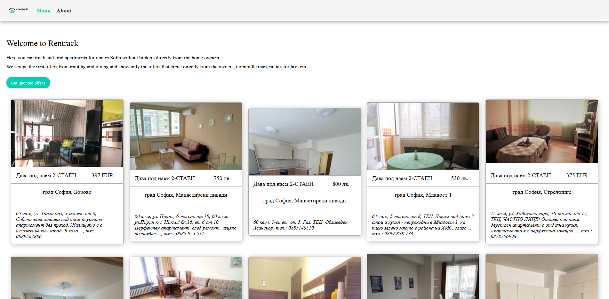

# Rentrack
Rentrack is web application for scraping appartment rental offers for Bulgaria, Sofia.

The application scrapes rental offers from imot.bg and olx.bg and presents only the offers that are directly from the home owners, removing all the agency offers.
This helps the users save from broker fees and rent their dream apartment for lower cost.

The project is splitted to cliend and server side.
For the client side it is used simple **Html, Css and vanilla Javascript** without any bundlers.
For the server side it is used **Node.js with Express** and **Puppeteer(for scraping)** + **Mysql db** and **Typeorm** for db connection/manipulation.

# Run the project
```
npm install
cd into server folder and run: node index.js
open index.html in browser
```

# App preview


